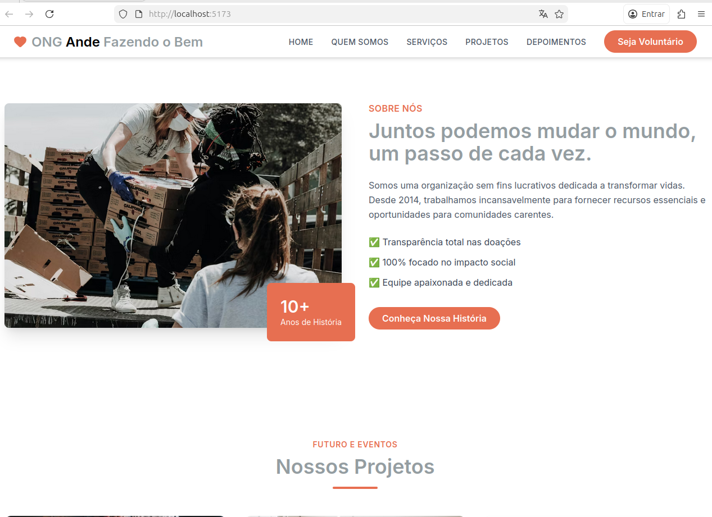

# ❤️ ONG Ande - Fazendo o Bem

> "Pequenas ações, grandes impactos."

!

## 📋 Sobre o Projeto

Este projeto é uma **Single Page Application (SPA)** desenvolvida como landing page para a **ONG Ande Fazendo o Bem**. O objetivo da aplicação é apresentar a organização, mostrar os projetos sociais, serviços prestados e, principalmente, facilitar a captação de voluntários e doações.

O design foi construído com foco em **Mobile-First**, performance e acessibilidade, utilizando uma interface moderna e responsiva.

## ✨ Funcionalidades

- **Header Dinâmico:** Navbar "Sticky" que altera seu estilo (transparência e cores) baseada no scroll da página.
- **Navegação Suave:** Links internos com efeito de "smooth scroll" para as seções (sem recarregamento de página).
- **Seções Modulares:**
  - **Hero:** Chamada para ação impactante.
  - **Quem Somos:** História e métricas da ONG.
  - **Serviços:** Cards informativos com ícones.
  - **Projetos:** Galeria de iniciativas futuras e passadas.
  - **Voluntariado:** CTA (Call to Action) para novos membros.
- **Layout Responsivo:** Adaptação total para desktop, tablets e celulares.

## 🚀 Tecnologias Utilizadas

O projeto foi desenvolvido utilizando as melhores práticas do mercado atual:

- **[React](https://react.dev/)** - Biblioteca JavaScript para construção de interfaces.
- **[Vite](https://vitejs.dev/)** - Build tool ultrarrápida.
- **[TypeScript](https://www.typescriptlang.org/)** - Superset do JavaScript para tipagem estática e segurança de código.
- **[Tailwind CSS](https://tailwindcss.com/)** - Framework CSS utilitário para estilização ágil.
- **[Lucide React](https://lucide.dev/)** - Biblioteca de ícones leves e modernos.

## 📂 Estrutura do Projeto

A arquitetura de pastas foi organizada para facilitar a manutenção e escalabilidade:

```bash
src/
├── assets/         # Estilos globais (global.css) e imagens
├── components/     # Componentes React modularizados
│   ├── layout/     # Header, Footer, Navbar
│   ├── sections/   # Hero, About, Services, Projects, etc.
│   └── ui/         # Componentes reutilizáveis (Button, SectionWrapper)
├── config/         # Configurações de ambiente e cores
├── pages/          # Página principal (Home)
└── main.tsx        # Ponto de entrada da aplicação